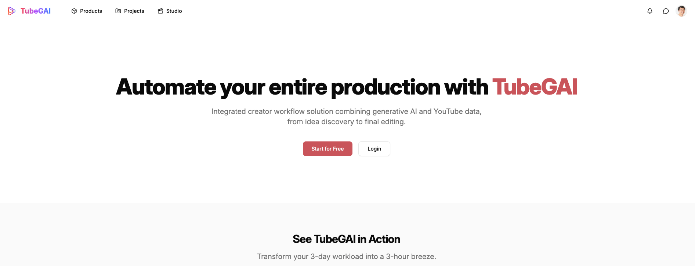
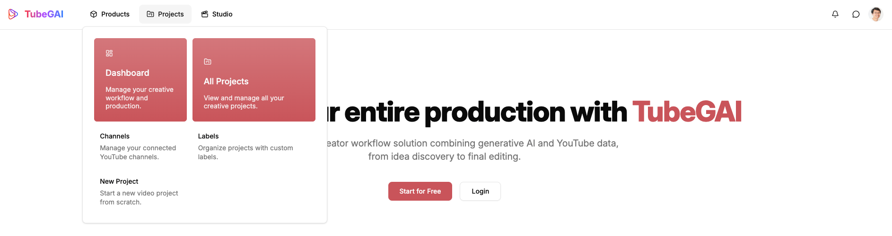
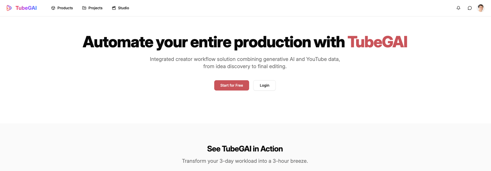
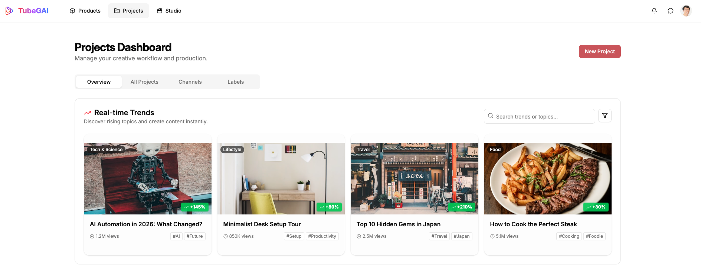
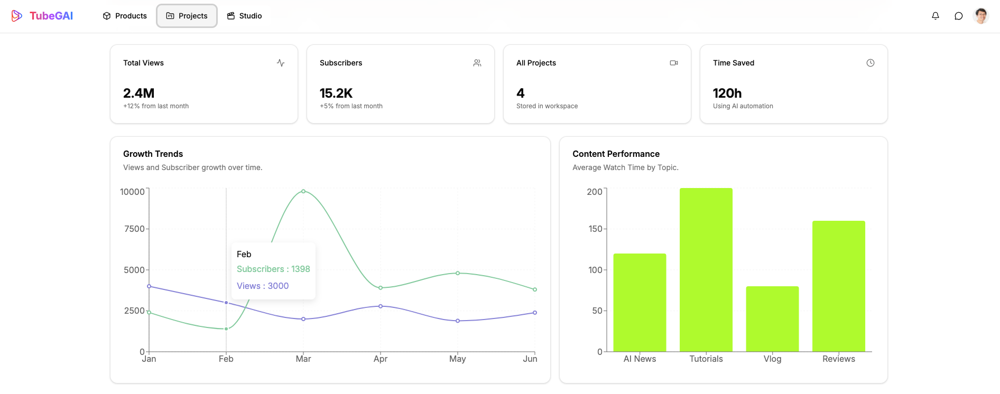
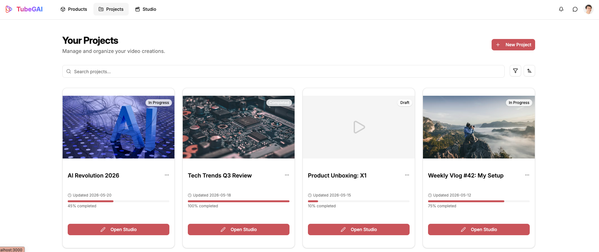

# UI 체크포인트 템플릿 #1

## 소개

- 아래 템플릿을 본인의 프로젝트 내용으로 채워주세요.
- "예상 작업"은 최소한의 가이드라인이며, 반드시 따를 필요는 없습니다.
- 현재까지 진행한 범위 내에서 최대한 솔직하게 공유해주시면 됩니다.

## 예상 작업(Expected Tasks)

- [x] 네비게이션 구현 (헤더, 사이드바 등 포함)
- [x] 핵심 레이아웃 구현 (랜딩, 로그인, 대시보드 등)
- [ ] `routes.ts`에 정의된 전체 페이지 중 **첫 1/3**에 해당하는 페이지 구현

---

## 네비게이션 구현

- Github 커밋 링크: https://github.com/sungalex/tubegai/commit/e6e86ac34daa33c5fb8bbdfc15605bd9e418635d
- 스크린샷:
  - 
  - 
- 설명:
  - Proudct, Projects, Dashboard, Login/Logout 메뉴 및 서브 Navigation 구현

---

## 핵심 레이아웃 구현

- Github 커밋 링크(Navigation 구현과 동일함. 한번에 Commit 함): https://github.com/sungalex/tubegai/commit/e6e86ac34daa33c5fb8bbdfc15605bd9e418635d
- 스크린샷:
  - 
  - 
  - 
- 설명:
  - Landing Page, Dashboard Page 구현
  - Dashboard Page에서 유튜브 API를 통해 실시간 트렌드를 분석하고, Project(영상제작) 테마를 선택하여 프로젝트를 생성할 수 있도록 구현

---

## 페이지별 구현 현황

### 페이지 이름 (모든 페이지에 대해 동일 양식을 사용할 것)

- Github 커밋 링크(Navigation 구현과 동일함. 한번에 Commit 함): https://github.com/sungalex/tubegai/commit/e6e86ac34daa33c5fb8bbdfc15605bd9e418635d
- 스크린샷:
  - 
- 설명:
  - Project Lists Page 구현
  - Project Lists Page에서 Studio로 이동할 수 있도록 구현
  - 모든 기능을 바이브 코딩 형태로 AI 도움을 받아서 구현함(Google AntiGravity 이용)
