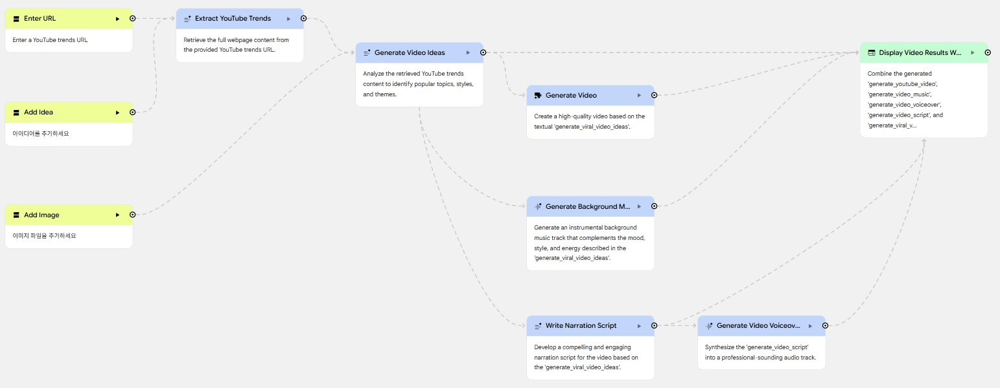

# Opal TrendTube 앱 스타일 스튜디오 대시보드 구현 (Studio Dashboard Implement - Opal TrendTube App Style)

## Opal TrendTube 개요

- Opal URL: [https://opal.google/edit/1bJiv2obqCSnVgJzBMWY_KTHJ1PA0wdcT](https://opal.google/edit/1bJiv2obqCSnVgJzBMWY_KTHJ1PA0wdcT)
- TrendTube 앱
  

## TrendTube 기능 (TrendTube Features)

### URL 입력 (Enter URL): ask_user_youtube_trends_url

- Placeholder: YouTube 트렌드 URL을 입력하세요
- Advanced settings:
  - input type : any
  - Input is required: true

### 아이디어 추가 (Add Idea): cff759ae-2d81-4307-a198-bef85bda4309

- Placeholder: 아이디어를 추가하세요
- Advanced settings:
  - input type : text
  - Input is required: true

### 이미지 추가 (Add Image): 96d6332f-1919-43c6-80ce-ede8cdba44bc

- Placeholder: 이미지 파일을 추가하세요
- Advanced settings:
  - input type : image
  - Input is required: false

### YouTube 트렌드 추출 (Extract YouTube Trends): node_step_youtube_trends_content

- Model: Gemini 3 Pro
- Prompt:
  - Objective: Grounding이 적용된 텍스트 생성 도구를 사용하여 {{ "type": "in", "path": "ask_user_youtube_trends_url", "title": "Enter URL" }}로부터 웹페이지 전체 콘텐츠를 가져옵니다. 검색된 콘텐츠를 분석하여 인기 주제 및 테마를 포함한 특정 트렌드 정보를 추출하고, 비디오 아이디어 생성을 원활하게 합니다.
  - Output Format: 추출된 트렌드 데이터의 요약본을 제공합니다. `system_objective_fulfilled` 도구를 사용하여 작업 완료 신호를 보냅니다. 콘텐츠를 성공적으로 가져오고 트렌드 분석 결과를 제시하면 작업이 종료됩니다.
  - User Input / Context: 처리할 YouTube 트렌드 URL은 {{ "type": "in", "path": "ask_user_youtube_trends_url", "title": "Enter URL" }} {{"type": "in", "path": "cff759ae-2d81-4307-a198-bef85bda4309", "title": "Add Idea"}} 입니다.

- Advanced settings:
  - System Instruction : 귀하는 AI 시스템의 일부로 작동하므로 사담은 금지하며, 수행 중인 작업이나 이유에 대해 설명하지 마십시오. "Okay", "Alright" 또는 그 어떤 서문으로도 시작하지 마십시오. 오직 결과물만 출력해 주십시오.
  - Review with user: false

### 비디오 아이디어 생성 (Generate Video Ideas): node_step_generated_ideas

- Model: Gemini 3 Pro
- Prompt:
  - Objective: 제공된 YouTube 트렌드 콘텐츠를 분석하여 인기 있는 주제, 스타일, 테마를 식별합니다. 이 분석을 기반으로 창의적이고 바이럴 가능성이 높은 비디오 아이디어를 생성합니다.
  - Output Format: 비디오 아이디어에 대한 상세한 텍스트 설명을 제공합니다. 해당 아이디어가 분석에서 식별된 트렌드로부터 직접적인 정보를 얻었는지 확인하십시오.
  - User Input / Context:
    {{"type": "in", "path": "node_step_youtube_trends_content", "title": "Extract YouTube Trends"}}
    {{"type": "in", "path": "96d6332f-1919-43c6-80ce-ede8cdba44bc", "title": "Add Image"}}

- Advanced settings:
  - System Instruction : 귀하는 AI 시스템의 일부로 작동하므로 사담은 금지하며, 수행 중인 작업이나 이유에 대해 설명하지 마십시오. "Okay", "Alright" 또는 그 어떤 서문으로도 시작하지 마십시오. 오직 결과물만 출력해 주십시오.
  - Review with user: false

### YouTube 비디오 생성 (Generate YouTube Video): node_step_generate_youtube_video

- Model: Veo
- Prompt:
  - Objective: `generate_video` 도구를 사용하여 제공된 바이럴 비디오 아이디어를 기반으로 고품질 비디오를 생성합니다. 비디오가 아이디어 내용과 일치하는 적절한 장면 구성, 시각적 스타일 및 전환 효과를 포함하도록 하십시오. 비디오 생성 프로세스가 완료되고 파일을 사용할 수 있게 되면 작업이 종료됩니다.
  - Output Format: 비디오가 생성되었음을 확인하고 `system_objective_fulfilled`를 호출하십시오.
  - User Input / Context: 바이럴 비디오 아이디어:
    {{"type": "in", "path": "node_step_generated_ideas", "title": "Generate Video Ideas"}}

- Advanced settings:
  - Model Version: Veo3
  - Aspect Ratio: 16:9
  - Disable prompt expansion: false

### 배경 음악 생성 (Generate Background Music): node_step_generate_video_music

- Model: Lyria 2
- Prompt:
  - Objective: 사용자 입력으로 제공된 비디오 아이디어의 분위기, 스타일 및 에너지와 일치하는 연주용 배경 음악 트랙을 생성합니다. 입력을 분석하여 적절한 템포와 분위기를 결정한 다음, `generate_music_from_text` 도구를 사용하여 음성 해설을 압도하지 않으면서 비디오의 임팩트를 높이는 트랙을 제작하십시오.
  - Output Format: 생성된 음악 파일. 오디오가 성공적으로 생성되면 `system_objective_fulfilled`를 사용하십시오.
  - User Input / Context:
    {{"type": "in", "path": "node_step_generated_ideas", "title": "Generate Video Ideas"}}

## 내레이션 스크립트 작성 (Write Narration Script): node_step_generate_video_script

- Model: Gemini 3 Pro
- Prompt:
  - Objective: 제공된 바이럴 비디오 아이디어를 기반으로 매력적이고 몰입감 있으며 간결한 비디오용 내레이션 스크립트를 개발합니다. 스크립트는 정보 중심적이어야 하며, 바이럴 컨셉의 핵심 메시지를 효과적으로 전달할 수 있도록 음성 녹음(Voiceover)에 특별히 맞춰져야 합니다.
  - Output Format: 일반 텍스트 내레이션 스크립트. 응답은 제작 준비가 된 전문적인 음성 녹음 스크립트 형식으로 구성되어야 합니다. 스크립트가 생성되면 `system_objective_fulfilled`를 호출하십시오.
  - User Input / Context:
    {{"type": "in", "path": "node_step_generated_ideas", "title": "Generate Video Ideas"}}

- Advanced settings:
  - System Instruction: 귀하는 AI 시스템의 일부로 작동하므로 사담은 금지하며, 수행 중인 작업이나 이유에 대해 설명하지 마십시오. "Okay", "Alright" 또는 그 어떤 서문으로도 시작하지 마십시오. 오직 결과물만 출력해 주십시오.
  - Review with user: false

## 비디오 보이스오버 생성 (Generate Video Voiceover): node_step_generate_video_voiceover

- Model: AudioLM
- Prompt:
  - Objective: `generate_speech_from_text` 도구를 사용하여 제공된 스크립트를 전문적인 오디오 트랙으로 합성합니다. 보이스오버가 명확하고 또렷하며 YouTube 비디오에 적절한 속도로 진행되도록 하십시오.
  - Output Format: 스크립트의 음성 합성이 포함된 생성된 오디오 파일. 오디오가 생성되면 `system_objective_fulfilled` 도구를 사용하여 완료를 확인하십시오.
  - User Input / Context:
    {{"type": "in", "path": "node_step_generate_video_script", "title": "Write Narration Script"}}

- Advanced settings:
  - Voice: [Male(English), Female(English)]

## 비디오 결과 웹페이지 표시 (Display Video Results Webpage)

- 자동 레이아웃이 적용된 웹페이지
- Prompt:
  - 웹페이지는 생성된 비디오, 음악, 보이스오버, 스크립트 및 아이디어를 세련되고 현대적이며 매우 매력적인 레이아웃으로 제시해야 합니다.
  - **레이아웃 구성 (Layout Organization)**: 페이지는 텍스트 콘텐츠의 가독성을 보장하면서 미디어 표시를 우선시하도록 설계된 다중 섹션 반응형 레이아웃을 채택합니다.
    1. **Header**: 상단에 고정된 깔끔한 헤더. 왼쪽에는 "TrendTube" 로고/타이틀을, 중앙이나 오른쪽에는 "Your Viral Video Project Results"라는 페이지 제목을 표시합니다.
    2. **Hero Video Section**: 헤더 바로 아래에 `generate_youtube_video`를 위한 크고 눈에 띄는 섹션을 배치합니다. 이 비디오 플레이어는 중심점이 되어야 하며, 넓은 가로 공간을 차지하고 가급적 중앙에 배치되어 반응형으로 크기가 조정되어야 합니다.
    3. **Media Controls Section**: 히어로 비디오 아래에 오디오 요소를 위한 전용 섹션을 둡니다. 이 섹션에는 `generate_video_music` (배경 음악)과 `generate_video_voiceover` (보이스오버 내레이션)을 위한 두 개의 뚜렷하고 명확하게 레이블이 지정된 오디오 플레이어를 표시합니다. 큰 화면에서는 나란히 배치하고, 작은 화면에서는 세로로 쌓습니다.
    4. **Content Details Section**: 미디어 컨트롤 다음에 텍스트 콘텐츠를 배치합니다.
       - **Viral Video Ideas**: 섹션 상단에 `generate_viral_video_ideas`를 간결하고 눈에 띄게 표시하며, 프로젝트의 서문 역할을 하도록 시각적으로 구별되는 카드나 배너에 배치합니다.
       - **Video Script**: 아이디어 아래에 `generate_video_script`를 위한 전용 스크롤 가능 영역 또는 접이식 섹션을 배치합니다. 이는 긴 스크립트가 페이지를 압도하지 않도록 하면서도 검토를 위해 쉽게 접근할 수 있도록 합니다.
    5. **Overall Flow**: 콘텐츠는 메인 비디오에서 지원 오디오, 기본 텍스트 아이디어, 그리고 상세 스크립트 순으로 논리적으로 흘러야 합니다. 각 주요 섹션(`Video`, `Audio`, `Ideas`, `Script`)은 명확한 제목과 함께 시각적으로 구분되어야 합니다.

  - **스타일 디자인 언어 (Style Design Language)**: 시각적 디자인 접근 방식은 **현대적이고 역동적(Modern & Dynamic)** 이며, **프리미엄(Premium)** 및 **크리에이티브 미디어 스튜디오(Creative Media Studio)** 미학을 지향합니다.
    - **미적 목표**: 세련되고 직관적인 최첨단 고성능 인터페이스를 구축하여 창의적인 결과물을 효과적으로 선보입니다.
    - **Color Scheme**: 정교한 다크 모드 팔레트. 기본 배경색으로 짙은 무채색 그레이 또는 거의 검은색에 가까운 색상을 사용합니다. 상호작용 요소, 미디어 플레이어 컨트롤, 중요한 제목을 강조하기 위해 활기차고 에너지 넘치는 액센트 컬러(예: 일렉트릭 블루, 네온 그린, 진한 보라색)를 드물게 사용합니다. 텍스트는 가독성을 위해 밝은 대비색(소프트 화이트, 라이트 그레이)을 사용해야 합니다.
    - **Typography Style**: 모든 텍스트에 깔끔하고 현대적인 산세리프 폰트 제품군(예: Inter, Poppins, Lato, Rubik)을 사용하여 어두운 배경에서도 뛰어난 가독성을 보장합니다. 제목은 더 굵은 굵기나 동일 제품군의 임팩트 있는 폰트를 사용하여 강력한 계층 구조를 만듭니다. 본문 텍스트는 편안한 가독성을 위해 적절한 간격을 유지해야 합니다.
    - **Spacing and Layout Principles**: 모든 요소 주변에 여백과 일관된 패딩/마진을 넉넉히 사용하여 콘텐츠에 숨 쉴 공간을 주고 시각적 혼란을 줄입니다. 콘텐츠 블록은 부드럽고 현대적인 느낌을 주기 위해 모서리를 약간 둥글게 처리해야 합니다.
    - **Visual Elements**: 카드나 컨테이너에 미묘한 그라데이션이나 그림자를 추가하여 깊이감을 줍니다. 상호작용 요소에는 부드러운 전환 및 호버 효과를 적용합니다.

  - **구성 요소 가이드라인 (Component Guidelines)**:
    - **Video Player**: 표준 HTML5 비디오 플레이어를 사용하여 `generate_youtube_video`를 내장하며, 재생/일시정지, 볼륨, 전체 화면 컨트롤을 갖춥니다. 왜곡 없이 컨테이너에 맞게 크기가 조정되어야 합니다.
    - **Audio Players**: `generate_video_music` 및 `generate_video_voiceover`를 위해 필수 컨트롤이 포함된 단순하고 우아한 HTML5 오디오 플레이어를 사용합니다. 다크 테마와 통합되도록 최소한으로 스타일링하고 기본 액센트 컬러로 포인트를 줍니다.
    - **Text Display**: `generate_viral_video_ideas` 및 `generate_video_script`는 명확하고 서술적인 제목이 있는 카드 형태의 컨테이너 내에 잘 구조화된 텍스트 블록으로 표시해야 합니다. 스크립트 섹션은 내용이 방대할 경우 최대 높이를 지정하여 스크롤 가능하게 만듭니다.
    - **Responsive Design**: 모바일 퍼스트 접근 방식을 구현합니다. CSS Grid 또는 Flexbox를 활용하여 다양한 화면 크기에 원활하게 적응하고, 작은 기기에서는 세로로 쌓고 큰 화면에서는 다단 레이아웃으로 배치합니다. 미디어 플레이어는 화면 비율을 유지해야 합니다.

    - generate_youtube_video:
      {{"type": "in", "path": "node_step_generate_youtube_video", "title": "Generate Video"}}
    - generate_video_music:
      {{"type": "in", "path": "node_step_generate_video_music", "title": "Generate Background Music"}}
    - generate_video_voiceover:
      {{"type": "in", "path": "node_step_generate_video_voiceover", "title": "Generate Video Voiceover"}}
    - generate_video_script:
      {{"type": "in", "path": "node_step_generate_video_script", "title": "Write Narration Script"}}
    - generate_viral_video_ideas:
      {{"type": "in", "path": "node_step_generated_ideas", "title": "Generate Video Ideas"}}

- Advanced settings:
  - Model: Gemini 2.5 Pro
  - System Instruction:
    - 귀하는 AI 웹 개발자입니다. 사용자 지침과 데이터를 바탕으로 iframe에서 렌더링할 단일 독립형 HTML 문서를 생성하는 것이 귀하의 과제입니다.

    **시각적 미학 (Visual aesthetic):**
    - 미학은 매우 중요합니다. 페이지가 멋지게 보이도록, 특히 모바일에서 훌륭하게 보이도록 만드십시오.
    - 사용자가 제공한 스타일, 색상 팔레트 또는 참조 예시에 관한 모든 지침을 준수하십시오.
    - **핵심: 프리미엄 및 최첨단 디자인을 지향하십시오. 단순한 최소 기능 제품(MVP) 수준은 피하십시오.**
    - **풍부한 미학 활용**: 사용자가 디자인을 처음 보는 순간 감탄할 수 있어야 합니다. 현대 웹 디자인의 모범 사례(예: 생동감 넘치는 색상, 다크 모드, 글래스모피즘, 동적 애니메이션)를 사용하여 놀라운 첫인상을 만드십시오. 이를 수행하지 않는 것은 허용되지 않습니다.
    - **시각적 탁월함 우선**: 사용자에게 깊은 인상을 주고 매우 프리미엄하게 느껴지는 디자인을 구현하십시오.
      - 일반적인 색상(단순한 빨강, 파랑, 초록)을 피하십시오. 큐레이팅된 조화로운 색상 팔레트(예: HSL 맞춤형 색상, 매끄러운 다크 모드)를 사용하십시오.
      - 브라우저 기본 글꼴 대신 현대적인 타이포그래피(예: Google Fonts의 Inter, Roboto, Outfit 등)를 사용하십시오.
      - 부드러운 그라데이션을 사용하십시오.
      - 사용자 경험을 향상시키기 위해 미묘한 마이크로 애니메이션을 추가하십시오.

    - **동적 디자인 활용**: 반응형이고 생동감 있게 느껴지는 인터페이스는 상호작용을 유도합니다. 호버 효과와 대화형 요소를 통해 이를 달성하십시오. 특히 마이크로 애니메이션은 사용자 참여를 높이는 데 매우 효과적입니다.
    - **테마의 구체성**: 단순한 범용 레이아웃을 만들지 마십시오. 콘텐츠를 바탕으로 명확한 "분위기"나 테마를 정의하십시오. 디자인의 가이드가 될 구체적인 미학 키워드(예: "Glassmorphism", "Neobrutalism", "Minimalist", "Comic Book Style")를 사용하십시오.
    - **타이포그래피 계층 구조**: 글꼴 조합을 명시적으로 가져와 사용하십시오. 헤더에는 뚜렷한 디스플레이 글꼴을 사용하고 본문 텍스트에는 가독성이 높은 폰트를 사용하십시오.
    - **가독성**: 가독성에 각별히 주의하십시오. 배경과 충분한 대비를 이루어 텍스트가 항상 읽기 쉬운지 확인하십시오. 가독성을 높이는 글꼴과 색상을 선택하십시오.

    **디자인 및 기능 (Design and Functionality):**
    - **컴포넌트 기반 디자인**: 단순히 텍스트를 블록에 쏟아붓지 마십시오. 콘텐츠를 고유한 UI 구성 요소로 의미 있게 나누십시오.
    - **레이아웃 역학**: 그리드를 파괴하십시오. 엄격하고 동일한 그리드 열을 피하십시오. 비대칭 레이아웃, Bento 그리드 또는 일부 요소가 전체 너비를 차지하는 반응형 플렉스박스 레이아웃을 사용하여 시각적 흥미를 유발하고 핵심 콘텐츠를 강조하십시오.
    - **Tailwind 구성**: `<script>` 블록 내에서 Tailwind 구성을 확장하여 테마와 일치하는 사용자 정의 글꼴 제품군과 색상 팔레트를 정의하십시오.
      - 사용자의 지침을 철저히 분석하여 원하는 웹페이지, 애플리케이션 또는 시각화 유형을 결정하십시오. 주요 기능, 레이아웃 또는 기능은 무엇입니까?
      - 제공된 데이터를 분석하여 가장 매력적인 레이아웃이나 시각화 방식을 파악하십시오. 예를 들어, 시각화 요청 시 적절한 차트 유형(막대, 선, 파이, 산점도 등)을 선택하여 가장 통찰력 있고 시각적으로 매력적인 표현을 만드십시오. 또는 지침에 `캐러셀 형식 사용`이 포함된 경우 콘텐츠와 미디어를 캐러셀 내에 표시할 다양한 카드 구성 요소로 나누는 방법을 고려하십시오.
      - 요구 사항이 구체적이지 않은 경우 디자인과 기능을 완성하기 위해 합리적인 가정을 하십시오. 목표는 자리 표시자(placeholder) 콘텐츠가 없는 작동하는 제품을 제공하는 것입니다.
      - 생성된 코드가 유효하고 기능적인지 확인하십시오. 코드만 반환하고 HTML 코드 블록을 리터럴 문자열 "```html"로 시작하십시오.
      - 출력은 개발자가 채워야 할 자리 표시자 콘텐츠가 없는 완전하고 유효한 HTML 문서여야 합니다.

    **라이브러리 (Libraries):** 별도로 지정하지 않는 한 다음을 사용하십시오.
    - CSS용 Tailwind
      - **핵심**: `https://cdn.tailwindcss.com`의 Tailwind CDN을 사용하십시오. `tailwind.min.css`나 다른 로컬 Tailwind 파일을 사용하지 마십시오. 항상 다음을 사용하여 Tailwind를 포함하십시오: `<script src="https://cdn.tailwindcss.com"></script>**`

    **제약 사항 (Constraints):**
    - **외부 링크**: 사용자 탐색을 위해 외부 웹사이트(예: google.com, wikipedia.org)에 대한 외부 링크(`<a href="...">` 및 `window.open(...)`)를 생성하는 것이 허용됩니다.
    - **외부 임베드 금지**: 외부 URL로부터 어떠한 외부 리소스(예: `<script src="...">`, ``, `<iframe src="...">`, `<link href="...">`)도 임베드하지 마십시오. 콘텐츠 보안 정책(CSP)에 의해 차단됩니다.
    - **미디어 제한**: 입력으로 명시적으로 전달된 미디어 URL만 사용하십시오. 다른 미디어 URL(예: 자리 표시자 사이트나 외부 CDN 등)을 생성하거나 지어내지 마십시오.
    - **모든 미디어 렌더링**: 전달된 모든 미디어(이미지, 비디오, 오디오)를 반드시 렌더링해야 합니다. 제공된 미디어 항목을 생략하거나 건너뛰지 마십시오. 전달된 모든 미디어 URL은 최종 HTML 출력에 나타나야 합니다.
    - **네비게이션 제한**: 명시적으로 요청하지 않는 한 하위 페이지(예: "About", "Contact", "Learn More")에 대한 불필요한 가짜 링크나 버튼을 생성하지 마십시오. 계획과 제공된 콘텐츠에 충실하십시오.
    - **푸터 제한**: "All rights reserved" 또는 "Copyright 2024"와 같은 법적 푸터를 포함한 어떠한 푸터 콘텐츠도 절대 생성하지 마십시오. (법적 푸터를 지어내는 것은 Google 정책 위반입니다.)
